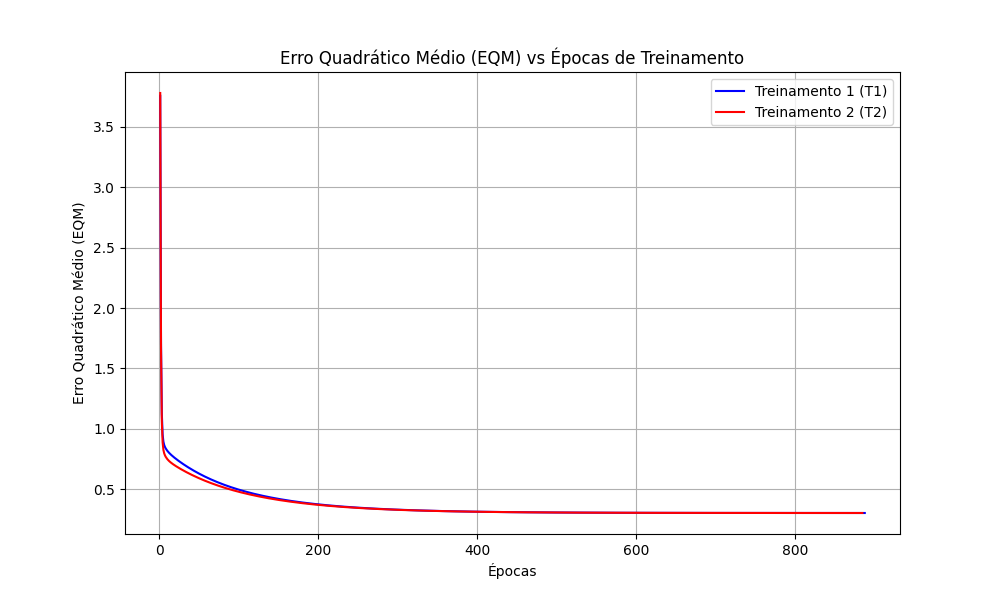

# Resultados da Atividade - Rede ADALINE (Válvulas A e B)

### Questão 1
> *Execute 5 treinamentos para a rede ADALINE inicializando o vetor de pesos em cada treinamento com valores aleatórios entre zero e um. Utilize taxa de aprendizado η = 0.0025 e precisão ε = 10-6.*

**Resposta:**
O treinamento foi implementado e executado através do script Python `adaline_valvulas.py`. Os resultados das 5 execuções, garantindo pesos iniciais aleatórios, estão registrados na tabela da Questão 2.

---

### Questão 2
> *Registre os resultados dos 5 treinamentos acima na tabela abaixo:*

**Resposta:**

| Treinamento | Inicial w0 | Inicial w1 | Inicial w2 | Inicial w3 | Inicial w4 | Final w0 | Final w1 | Final w2 | Final w3 | Final w4 | Épocas |
|---|---|---|---|---|---|---|---|---|---|---|---|
| **1º (T1)** | 0.6765 | 0.9094 | 0.0033 | 0.9315 | 0.5310 | -1.8130 | 1.3129 | 1.6423 | -0.4275 | -1.1778 | 938 |
| **2º (T2)** | 0.6667 | 0.0927 | 0.9762 | 0.3700 | 0.8969 | -1.8131 | 1.3129 | 1.6423 | -0.4277 | -1.1778 | 909 |
| **3º (T3)** | 0.8224 | 0.7327 | 0.0424 | 0.6636 | 0.3229 | -1.8132 | 1.3129 | 1.6424 | -0.4277 | -1.1778 | 934 |
| **4º (T4)** | 0.7537 | 0.3099 | 0.5145 | 0.7637 | 0.7799 | -1.8130 | 1.3129 | 1.6423 | -0.4276 | -1.1778 | 933 |
| **5º (T5)** | 0.7782 | 0.1366 | 0.7329 | 0.9321 | 0.4711 | -1.8131 | 1.3129 | 1.6424 | -0.4276 | -1.1778 | 931 |

*(Nota: O ADALINE utiliza x0 = -1 como bias padrão na implementação).*

---

### Questão 3
> *Para os dois primeiros treinamentos realizados acima trace os respectivos gráficos dos valores de erro quadrático médio (EQM) em função de cada época de treinamento. Imprima os dois gráficos numa mesma folha.*

**Resposta:**
O gráfico abaixo foi gerado automaticamente pelo algoritmo, demonstrando a curva de descida do gradiente e minimização do erro (EQM) ao longo das épocas para os treinamentos 1 e 2.

---

### Questão 4
> *Para todos os treinamentos realizados acima, aplique a rede ADALINE para classificar e indicar ao comutador se os sinais abaixo devem ser encaminhados para a válvula A ou B.*

**Resposta:**
Abaixo segue a classificação (`-1` para Válvula A e `+1` para Válvula B) das amostras de teste, validada de forma unânime utilizando os pesos obtidos em todos os 5 treinamentos.

| Amostra | x1 | x2 | x3 | x4 | y (T1) | y (T2) | y (T3) | y (T4) | y (T5) |
|---|---|---|---|---|---|---|---|---|---|
| **1** | 0.9694 | 0.6909 | 0.4334 | 3.4965 | -1 | -1 | -1 | -1 | -1 |
| **2** | 0.5427 | 1.3832 | 0.6390 | 4.0352 | -1 | -1 | -1 | -1 | -1 |
| **3** | 0.6081 | -0.9196 | 0.5925 | 0.1016 | 1 | 1 | 1 | 1 | 1 |
| **4** | -0.1618 | 0.4694 | 0.2030 | 3.0117 | -1 | -1 | -1 | -1 | -1 |
| **5** | 0.1870 | -0.2578 | 0.6124 | 1.7749 | -1 | -1 | -1 | -1 | -1 |
| **6** | 0.4891 | -0.5276 | 0.4378 | 0.6439 | 1 | 1 | 1 | 1 | 1 |
| **7** | 0.3777 | 2.0149 | 0.7423 | 3.3932 | 1 | 1 | 1 | 1 | 1 |
| **8** | 1.1498 | -0.4067 | 0.2469 | 1.5866 | 1 | 1 | 1 | 1 | 1 |
| **9** | 0.9325 | 1.0950 | 1.0359 | 3.3591 | 1 | 1 | 1 | 1 | 1 |
| **10** | 0.5060 | 1.3317 | 0.9222 | 3.7174 | -1 | -1 | -1 | -1 | -1 |
| **11** | 0.0497 | -2.0656 | 0.6124 | -0.6585 | -1 | -1 | -1 | -1 | -1 |
| **12** | 0.4004 | 3.5369 | 0.9766 | 5.3532 | 1 | 1 | 1 | 1 | 1 |
| **13** | -0.1874 | 1.3343 | 0.5374 | 3.2189 | -1 | -1 | -1 | -1 | -1 |
| **14** | 0.5060 | 1.3317 | 0.9222 | 3.7174 | -1 | -1 | -1 | -1 | -1 |
| **15** | 1.6375 | -0.7911 | 0.7537 | 0.5515 | 1 | 1 | 1 | 1 | 1 |

---

### Questão 5
> *Embora o número de épocas de cada treinamento realizado no item 2 seja diferente, explique por que então os valores dos pesos continuam praticamente inalterados.*

**Resposta:**
Isso ocorre devido a uma característica matemática fundamental da rede ADALINE: **a existência de um único mínimo global.** 

Diferente de outras redes, o ADALINE usa o Erro Quadrático Médio (EQM) para guiar o aprendizado através da Regra Delta (LMS). A função matemática do EQM forma uma superfície paraboloide — uma "tigela" perfeitamente convexa que possui apenas um ponto inferior (o menor erro possível).

* **Por que os pesos finais são iguais:** Não importa de onde a inicialização aleatória dos pesos comece, o algoritmo de descida do gradiente sempre deslizará em direção ao fundo dessa tigela, que é o conjunto ideal e único de pesos ótimos, fazendo com que os 5 treinamentos convirjam para praticamente o mesmo valor.
* **Por que as épocas variam:** Como os pesos começam de posições aleatórias diferentes na "borda da tigela", a distância e o caminho que o algoritmo precisa percorrer até chegar ao fundo (mínimo global) variam, exigindo assim mais ou menos passos de ajuste (épocas) dependendo do ponto de partida.
