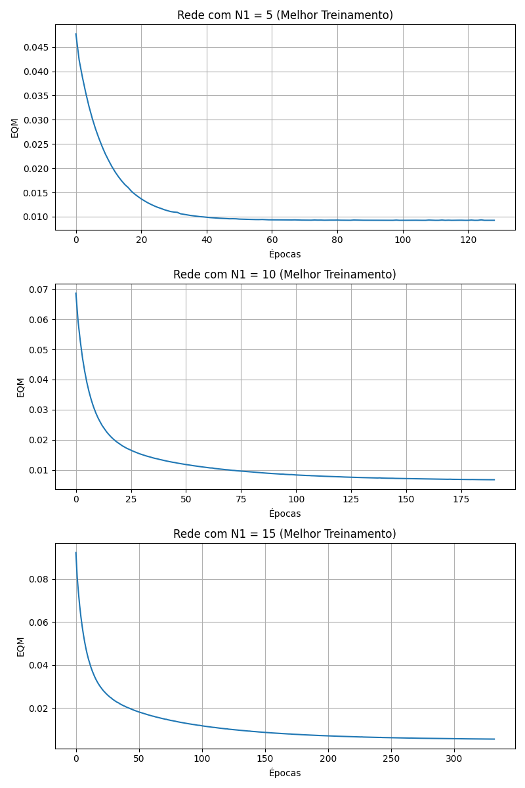

# Resultados da Atividade - Rede RBF (Aproximação de Função)

### Questão 1
> *Execute 3 treinamentos para cada topologia de rede RBF definida anteriormente, inicializando a matriz de pesos da camada de saída com valores aleatórios entre 0 e 1. Se for o caso, reinicie o gerador de números aleatórios em cada treinamento de tal forma que os elementos das matrizes de pesos iniciais não sejam os mesmos. Utilize uma taxa de aprendizado η = 0.01 e precisão ε = 10-7.*

**Resposta:**
O script executou o algoritmo K-Means para agrupar o espaço de entrada e utilizou a Regra Delta para a camada de saída. Todos os pesos foram iniciados aleatoriamente entre 0 e 1, e os treinamentos pararam ao atingir a convergência de $\epsilon = 10^{-7}$.

---

### Questão 2
> *Registre os resultados finais desses 3 treinamentos para cada uma das três topologias de rede na tabela a seguir:*

**Resposta:**

| Treinamento | Rede 1 (N1=5) EQM | Rede 1 Épocas | Rede 2 (N1=10) EQM | Rede 2 Épocas | Rede 3 (N1=15) EQM | Rede 3 Épocas |
|:---:|:---:|:---:|:---:|:---:|:---:|:---:|
| **1º (T1)** | 0.009251 | 126 | 0.006735 | 190 | 0.005588 | 332 |
| **2º (T2)** | 0.009250 | 127 | 0.006528 | 199 | 0.005252 | 424 |
| **3º (T3)** | 0.009255 | 128 | 0.006480 | 229 | 0.005359 | 343 |

---

### Questão 3
> *Para todos os treinamentos efetuados no item 2, faça a validação da rede em relação aos valores desejados apresentados na tabela abaixo. Forneça para cada treinamento o erro relativo médio (%) entre os valores desejados e os valores fornecidos pela rede em relação a todos os padrões de teste. Obtenha também a respectiva variância (%).*

**Resposta:**

| Amostra | x1 | x2 | x3 | d | R1 y(T1) | R1 y(T2) | R1 y(T3) | R2 y(T1) | R2 y(T2) | R2 y(T3) | R3 y(T1) | R3 y(T2) | R3 y(T3) |
|:---:|:---:|:---:|:---:|:---:|:---:|:---:|:---:|:---:|:---:|:---:|:---:|:---:|:---:|
| **01** | 0.5102 | 0.7464 | 0.0860 | 0.5965 | 0.5534 | 0.5521 | 0.5537 | 0.5723 | 0.5703 | 0.5759 | 0.6080 | 0.6005 | 0.5880 |
| **02** | 0.8401 | 0.4490 | 0.2719 | 0.6790 | 0.6473 | 0.6456 | 0.6478 | 0.6768 | 0.6656 | 0.6689 | 0.6455 | 0.6336 | 0.6368 |
| **03** | 0.1283 | 0.1882 | 0.7253 | 0.4662 | 0.4156 | 0.4143 | 0.4173 | 0.4884 | 0.4891 | 0.4941 | 0.4368 | 0.4264 | 0.4276 |
| **04** | 0.2299 | 0.1524 | 0.7353 | 0.5012 | 0.4168 | 0.4155 | 0.4186 | 0.5116 | 0.5083 | 0.5122 | 0.4778 | 0.4682 | 0.4694 |
| **05** | 0.3209 | 0.6229 | 0.5233 | 0.6810 | 0.6534 | 0.6506 | 0.6547 | 0.6970 | 0.6935 | 0.6986 | 0.6858 | 0.6907 | 0.6859 |
| **06** | 0.8203 | 0.0682 | 0.4260 | 0.5643 | 0.5957 | 0.5937 | 0.5965 | 0.5571 | 0.5486 | 0.5517 | 0.5758 | 0.5653 | 0.5668 |
| **07** | 0.3471 | 0.8889 | 0.1564 | 0.5875 | 0.5788 | 0.5772 | 0.5794 | 0.5926 | 0.5793 | 0.5800 | 0.5895 | 0.5732 | 0.5741 |
| **08** | 0.5762 | 0.8292 | 0.4116 | 0.7853 | 0.8035 | 0.8014 | 0.8043 | 0.8184 | 0.8084 | 0.8117 | 0.8130 | 0.8165 | 0.8119 |
| **09** | 0.9053 | 0.6245 | 0.5264 | 0.8506 | 0.9308 | 0.9289 | 0.9319 | 0.9299 | 0.9166 | 0.9191 | 0.9344 | 0.9173 | 0.9221 |
| **10** | 0.8149 | 0.0396 | 0.6227 | 0.6165 | 0.6016 | 0.5997 | 0.6025 | 0.5774 | 0.5706 | 0.5743 | 0.5968 | 0.5909 | 0.5904 |
| **11** | 0.1016 | 0.6382 | 0.3173 | 0.4957 | 0.5584 | 0.5560 | 0.5594 | 0.5192 | 0.5125 | 0.5159 | 0.5161 | 0.5208 | 0.5178 |
| **12** | 0.9108 | 0.2139 | 0.4641 | 0.6625 | 0.6495 | 0.6475 | 0.6503 | 0.6064 | 0.5967 | 0.5996 | 0.6109 | 0.5957 | 0.5995 |
| **13** | 0.2245 | 0.0971 | 0.6136 | 0.4402 | 0.3849 | 0.3836 | 0.3868 | 0.4288 | 0.4217 | 0.4248 | 0.4339 | 0.4289 | 0.4284 |
| **14** | 0.6423 | 0.3229 | 0.8567 | 0.7663 | 0.6782 | 0.6765 | 0.6794 | 0.7615 | 0.7486 | 0.7504 | 0.7279 | 0.7202 | 0.7207 |
| **15** | 0.5252 | 0.6529 | 0.5729 | 0.7893 | 0.8778 | 0.8751 | 0.8790 | 0.8988 | 0.8878 | 0.8904 | 0.8538 | 0.8505 | 0.8490 |
| **Erro Relativo Médio (%)** | - | - | - | - | 7.65 | 7.73 | 7.57 | 4.39 | 4.61 | 4.63 | 4.27 | 4.93 | 4.79 |
| **Variância (%)** | - | - | - | - | 21.80 | 21.42 | 21.41 | 13.38 | 10.44 | 10.48 | 7.49 | 8.62 | 8.06 |

---

### Questão 4
> *Para cada uma das topologias apresentadas na tabela acima, considerando ainda o melhor treinamento {T1, T2 ou T3} realizado em cada uma delas, trace o gráfico dos valores de erro quadrático médio (EQM) em função de cada época de treinamento. Imprima os três gráficos numa mesma folha de modo não superpostos.*

**Resposta:**
Os gráficos de convergência do Erro Quadrático Médio ao longo das épocas (para o melhor treinamento de cada topologia) foram gerados e salvos no arquivo `grafico_eqm_rbf2.png`.

---

### Questão 5
> *Baseado nas análises dos itens acima, indique qual das topologias candidatas {Rede 1, Rede 2 ou Rede 3} e com que qual configuração final de treinamento {T1, T2 ou T3} seria a mais adequada para este problema.*

**Resposta:**
Analisando os resultados da tabela de validação, a topologia mais adequada é a **Rede 3 (com N1 = 15)**, especificamente no treinamento **T1**. Esta configuração obteve o menor Erro Relativo Médio (4.27%) no conjunto de testes, demonstrando a melhor capacidade de generalização e aproximação contínua da função desejada.